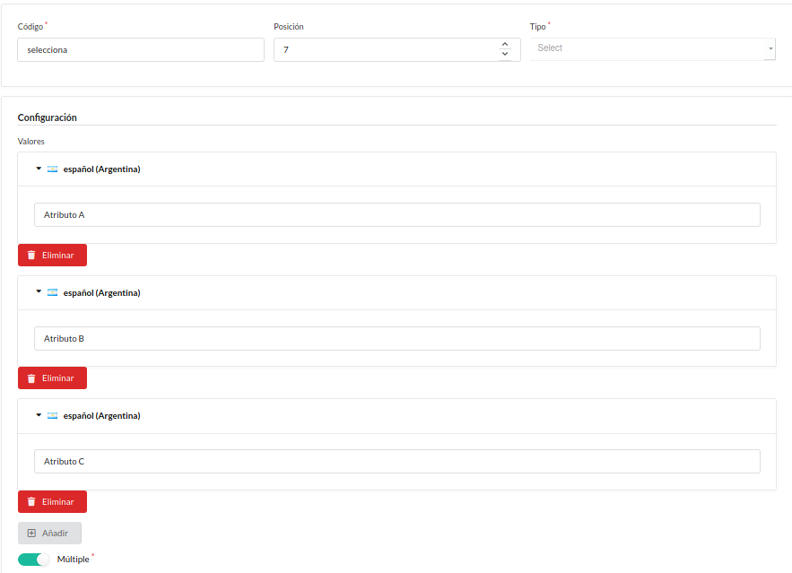

Catálogo
========

   Menú de Catálogo.

El menú Catálogo contiene los ítems:

* Taxones_
* Productos_
* Inventario_
* Atributos_
* `Opciones de producto`_
* `Tipos de asociación`_

-----------

.. _Taxones:

Taxones
*******

Los Taxones son una forma de agrupar en **categorías** los diferentes productos.

Los mismos se ordenarán en forma de *árbol de directorios* para facilitar su búsqueda y discriminación.

   Taxones.

.. tip:: Se recomienda el uso de **taxones** debido a la complejidad que implica administrar todos los productos de manera independiente.

Supongamos que deseemos crear un *nuevo taxón* que corresponderá a un conjunto de productos denominados **cortinas**

En ese caso  ingresamos a **Crear**. Colocamos un **código**, un **nombre** y permitimos que el sistema cree el **Slug** [#0]_ automáticamente.

.. figure:: images/33-catalogo-taxones2.png
   :align: center

   Crear taxón.

Podemos agregar una descripción e imágenes, de ser necesario.

Seguidamente le damos click a **Crear** y veremos que nos aparece la nueva categoría.

   Nuevo taxón.

.. figure:: images/35-catalogo-taxones4.png
   :align: right

   Crear sub-taxón.

Si necesitamos incorporar un nuevo "sub-grupo", por ejemplo: **Cortinas de tela**.

Ingresaremos en las opciones del taxón indicado por tres puntos (**...**) y seleccionaremos **Crear**.

A continuación ingresaremos los nuevos datos y procederemos a crear este *nuevo taxón* **dependiente del anterior**.

.. figure:: images/36-catalogo-taxones5.png
   :align: center

   Nuevo sub-taxón.

----------

De esta forma podremos agregar taxones y subirlos o bajarlos de nivel conforme a nuestra administración de productos los requiera.

Aquí vemos un ejemplo con varias categorías:

.. figure:: images/37-catalogo-taxones6.png
   :align: center

   Ejemplo de árbol de taxones.

.. _Productos:

Productos
*********

Ingresamos a la sección productos.

.. figure:: images/38-catalogo-productos.png
   :align: center

   Productos.

.. figure:: images/39-catalogo-productos2.png
   :align: right

   Tipos de productos.

Al hacer click en **Crear** se abre un desplegable con dos tipos de productos:

* Simple_
* Configurable_

**Productos Simples:** Los productos simples son los que se ofrecen en una única presentación, sin variedades posibles.

Por lo tanto no se puede optar por otros colores, ni tamaños, ni sabores, etc.

**Productos Configurables:** Son aquellos que se ofrecen con, **al menos una variedad** posible.

Ya sea por colores, tamaños, etc. o por una combinación de ellas. Por ejemplo: gaseosas de diferentes volúmenes y sabores. 

.. _Simple:

Elegimos el tipo de producto que deseamos crear (en el ejemplo un producto **simple**) y completamos el formulario que nos aparece

.. figure:: images/40-catalogo-productos3.png
   :align: center

   Formulario de *productos simples*.

.. hint:: Los campos **Meta palabras claves** y **Meta descripción** se completan con las palabras más destacables y representativas que componen el título y la descripción respectivamente. Debe utilizar pocas palabras, estas no se mostrarán pero serán usadas por los buscadores. 

Note que en la parte inferior del formulario se permite agregar información acerca del producto, para su envío.

Allí se detallan las dimensiones, el peso, etc. Y se asígna una categoría de envío que es útil a la hora de determinar el precio del transporte.

También es posible asignar una categoría impositiva que determinará el conjunto de impuestos a abonar por el producto.

   Envío e Impuestos.

Una vez completado el formulario vemos en el margen izquierdo una serie de botones que permiten configurar características del producto.

Tenga en cuenta que esta lista es ligeramente diferente en productos configurables.

   Configuración de Productos.

Ingresando a **Taxonomía** seleccionamos el *desplegable* de **Taxón principal** y le asignamos la categoría correspondiente al producto.

A su vez podemos *tildar* los taxones superiores a la categoría seleccionada para que el producto se muestre también en ellos.

.. hint:: Se recomienda tildar los taxones superiores a la categoría del producto a crear.

De Atributos_ y Asociaciones hablaremos más adelante.

Otra cosa que podemos y deberíamos agregar a nuestro producto es una o más imágenes.

   Imágenes.

.. tip:: Es muy recomendable agregar imágenes propias (sin derechos de autor), en caso que no se cuente con un profesional procurar una buena calidad de imágen con mucha luz natural.

Por último (en un producto **simple**) podremos introducir las unidades que nos restan en el inventario_ y realizar un seguimiento para que la venta del producto se detenga en el caso que no contemos con disponibilidad.

   Inventario del producto nuevo.

.. note:: La administración del `inventario en un producto configurable`_ se comentará más adelante.

.. important:: Si el **seguimiento** está **Desactivado**, el producto no aparecerá en el la sección Inventario_ .

Finalmente le damos click al botón **Crear** y nuestro producto se podrá ver en la lista.

.. _Inventario:

Inventario
**********

Para administrar el inventario disponemos de su sección.

Aquí observaremos la lista de productos, las cantidades disponibles de cada uno y a los que se encuentran sin disponibilidad.

Ingresando a **editar** podremos modificar la existencia y otras características en caso de ser necesario.

   Inventario.

.. _seguimiento:

El seguimiento permite monitorizar la existencia del producto conforme se vendan unidades, reduciendo su número en cada pedido.

Si **no se marca** esta opción, el producto siempre estará disponble para la compra.

.. attention:: Si seleccionamos **con seguimiento**, se detendrá la venta del producto cuando se agote la existencia.

.. figure:: images/46-catalogo-inventario2.png
   :align: center

   Inventario.

.. hint:: Mantenga actualizado el inventario de sus productos.

.. _Atributos:

Atributos
*********

Esta sección nos permite ingresar atributos que pueden ser compartidos por varios productos.

Los mismos se mostrarán en una pestaña *como descripción del producto* cuando el cliente lo vea.

.. figure:: images/47-catalogo-atributos.png
   :align: center

   Atributos.

Crearemos diferentes atributos a modo de ejemplo, que luego se pueden ajustar a las necesidades de la empresa.

- Texto_
- `Área de texto`_
- `Casilla de verificación`_
- `Número entero`_
- Porcentaje_
- `Fecha y hora`_
- Fecha_
- Selecciona_

Finalmente veremos como se agregan `múltiples atributos a un producto`_ .

.. _Texto:

Texto
.....

Aquí podemos agregar un simple **texto** como característica del producto.

Vamos a ingresar un texto con una longitud mínima de *un* caracter alfanumérico y una máxima de *cinco*.

   Atributo Texto.

Una vez ingresado lo vemos en la lista de **atributos**.

   Lista de Atributos.

.. _previamente:

Ahora podemos asignar el **atributo** a cualquier **producto**.

Tomemos de ejemplo el creado recientemente, ingresamos a:

::

  Productos > Editar > Atributos

Y luego en el deslizable seleccionamos *texto* y hacemos click en **Agregar atributos**

   Agregar Texto.

Veremos que se agrega el atributo pudiendo ingresar el texto con las condiciones previamente determinadas. En el ejemplo como texto se utiliza la palabra *cinco*.

   Ejemplo Texto.

Finalmente vemos como se visualiza el atributo en la pestaña del producto que se muestra al cliente.

   Atributo Texto visto por el cliente.

.. _Área de texto:

Área de texto
.............

Este atributo es similar al anterior, con la diferencia que permite incorporar un texto completo sin límites de caracteres.

Primero agregamos el Atributo:

   Atributo Área de texto.

Luego, al configurar un producto le agregamos el atributo como se explicó previamente_ .

   Área de texto en un producto particular.

Una vez completado el texto a incorporar guardamos y podremos visualizar el texto en la página del cliente de la siguiente manera:

   Área de texto vista por el cliente.

.. _Casilla de verificación:

Casilla de verificación
.......................

Para comenzar agregamos el atributo **Casilla de verificación**.

El mismo nos incorporará un interruptor permitirá agregar un **SI** o un **NO** a la característica que especifiquemos en el Nombre (en el ejemplo *Casilla de verificación*).

   Casilla de verificación.

.. tip:: Es útil agregar varias veces este atributo en productos que pueden *contener* o *no contener* una serie de características binomiales. Por ejemplo **cocinas**: *con* o *sin* horno, *con* o *sin* encendido eléctrico, etc. .

Al agregar el atributo al producto específico nos mostrará el interruptor y podremos *activarlo* o dejarlo *desactivado* según cuente o no con la característica el producto.

   Atributo Casilla de verificación.

Por último comprobamos la vista en el cliente con un **SI** o un **NO**

   Vista del atributo Casilla de verificación como cliente.

.. _Número entero:

Número entero
.............

Si deseamos incorporar una característica de la cual nuestro producto puede contener un número entero variable (ej: Hornallas en cocinas). Entoces debemos agregar este atributo.

   Número entero.

Nuevamente en las opciones del producto incorporamos el atributo y el valor para el mismo en este producto en particular.

   Atributo Número entero.

Finalmente vemos como lo muestra en el cliente la aplicación:

   Vista del atributo Número entero como cliente.

.. _Porcentaje:

Porcentaje
..........

Al igual que en el número entero, en este caso deseamos incorporar un **Porcentaje**.

   Porcentaje.

Dentro del producto ingresamos el atributo y el valor del porcentaje.

   Atributo Porcentaje.

Y vemos como se muestra al cliente

   Atributo porcentaje como cliente.

.. _Fecha y hora:

Fecha y hora
............

Para ingresar un campo con *fecha y hora fijas* como atributo de un producto, se utiliza esta opción.

   Fecha y hora.

.. attention:: Para ingresar el campo *Formato* se utilizan los códigos de fecha y hora `ISO8601 <https://es.wikipedia.org/wiki/ISO_8601>`_.

En el producto además del atributo le asignamos los valores de fecha y hora.

.. figure:: images/66-catalogo-atributos20.png
   :align: center

   Atributo Fecha y hora.

Por último el cliente lo verá de la siguiente manera:

   Fecha y hora como visualiza el cliente.

.. _Fecha:

Fecha
.....

Igual a `Fecha y hora`_ sin necesidad de determinar la hora.

.. hint:: Útil para indicar fechas de vencimiento.

.. _Selecciona:

Selecciona
..........

Si queremos agregar una lista de opciones, de las cuales seleccionaremos una o varias para indicar como atributo del producto deberíamos usar esta opción.

Para ello Creamos el atributo **Selecciona**.

Añadimos las opciones que deseamos que contenga la lista y especificamos si se podra seleccionar más de una opción a la vez

   Añadiendo opciones a la lista Selecciona

Luego especificamos cuál es el número mínimo y máximo de opciones a seleccionar. Y creamos el atributo.

   Agregando atributo *Selecciona*.

Por otro lado en el producto, agregamos el atributo y seleccionamos la o las opciones que correspondan al producto en particular.

   Atributo *Selecciona* en configuración del producto.

De esta manera lo visualizará el cliente:

   Visualización de los atributos seleccionados.

.. _múltiples atributos a un producto:

Múltiples atributos
...................

Para agregar múltiples atributos nos situamos en el botón **Atributos** de un producto.

En el desplegable seleccionamos todos los atributos que quisieramos incorporarle al producto y hacemos click en Agregar atributos.

Luego completamos los mismos y guardamos.

   Selección de Atributos.

Finalmente el cliente verá los múltiples Atributos de esta manera:

   Visualización de los múltiples Atributos.

.. _Opciones de producto:

Opciones de producto
********************

Podremos crear opciones de productos que sean compartidas por varios como el color o los tamaños.

Para crear estas opciones nos dirigimos a **Opciones de producto** y le damos click a **Crear**.

   Opciones de productos.

Como ejemplo crearemos la opción **Color**, con dos variantes **Blanco** y **Negro**.

Completamos los campos y para agregar cada variante presionamos en *Añadir valor*.

   Nueva opción **Color**.

También crearemos otra opción llamada **Longitud**. Repetimos el proceso pero esta vez agregamos tres variantes: **Corto**, **Medio** y **Largo**.

   Opción **Longitud**.

Y creamos la nueva opción con el botón **Crear**.

   Crear opción **Longitud**.

.. _Configurable:

Ahora vamos a Crear un producto **Configurable**.

   Crear producto **Configurable**.

Este producto se llamará **Barral de madera**. Y en la lista **Opciones de producto** seleccionaremos las dos opciones que hemos creado, *Color* y *Longitud*.

.. _optamos:

   Seleccionar opciones.

El **Método de selección variante** determinará la forma en la que se muestren las opciones al cliente:

* La `Opción tipo variante`_ muestra una lista con todas las opciones.
* Las `Opciones que coinciden`_ muestra una serie de desplegables para seleccionar la combinación deseada.

.. figure:: images/80-catalogo-opciones7.png
   :align: center

   Formulario.

Luego completaremos los otros ítems que deseemos. Ahora sólo nos detendremos a mostrar la imagen que agregamos:

   Imagen.

Le damos click a **Crear** y nos mostrará la edición del producto. Aquí seleccionaremos **Administrar variantes**.

   Edición del producto.

Una vez que se abre el desplegable podremos elegir entre *Listar variantes*, *Crear* y *Generar*.

   Generar variantes.

Vamos a elegir **Generar** y lo que hará es combinar las variantes seleccionadas previamente entre sí, para producir las distintas opciones de productos. En el ejemplo: Blanco: Chico, Mediano y Grande; y Negro: Chico, Mediano y Grande. En total 6 variedades de un mismo producto.

   Variantes del producto.

Esto nos ayudará a configurar cada variedad del producto en particular.

   Configuración de precios para las variantes del producto.

Una vez configuradas todas podremos editar cada variante independientemente.

   Lista de variantes del producto.

Dentro de la edición podremos modificar **categorías de envíos** (modificando así los cargos por envío), **Impuestos** y el **Inventario** de la variante del producto (administrado independientemente a diferencia del *producto simple*).. 

   Edición de variantes del producto.

   **Impuestos** de la variante del producto.

.. _inventario en un producto configurable:

En el inventario de la variante del producto podremos indicar el número de unidades disponibles y realizar el seguimiento_ de las mismas.

   **Inventario** de la variante del producto.

Guardamos los cambios y podremos ver la lista de variantes para administrarlas.

   Lista de variantes.

Finalmente podremos ver como visualiza el cliente las diferentes variantes de nuestro producto, dependiendo del **Método de selección variante** por el que optamos_.

.. _Opción tipo variante:

.. figure:: images/91-catalogo-opciones18-2.png
   :align: center

   Vista del cliente de un producto *Opción tipo variante*.

.. _Opciones que coinciden:

   Vista del cliente de un producto *Opciones que coinciden*.

.. _Tipos de asociación:

Tipos de asociación
*******************

Se asocia un producto a otro cuando ambos se utilizan en conjunto o están relacionados. Por ejemplo un cinturón y un pantalón, una jarra y vasos, etc.

Al asociarlos lograremos mostrar como sugerencia los productos asociados al producto seleccionado.

Para ello vamos a  **Tipos de asociación** e ingresamos a **Crear**

   Tipos de asociación.

Creamos un nuevo tipo de asociación. En este ejemplo **Asociación 1** .

   Creando Asociación 1.

Luego ingresamos en el producto de interés y en el apartado **Asociaciones** seleccionamos los productos asociados.

   Agregando asociaciones.

Una vez finalizado guardamos los cambios.

   Guardamos los cambios.

Finalmente el cliente podrá visualizar los productos asociados de la siguiente manera.

   Productos asociados.

--------------------

.. rubric:: Notas:

.. [#0] Slug: Es un texto que se agrega luego del nombre de dominio y forma parte de la dirección que conduce hacia tu contenido. El slug sería la parte que se encuentra luego de la barra (/).

