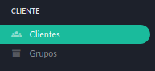
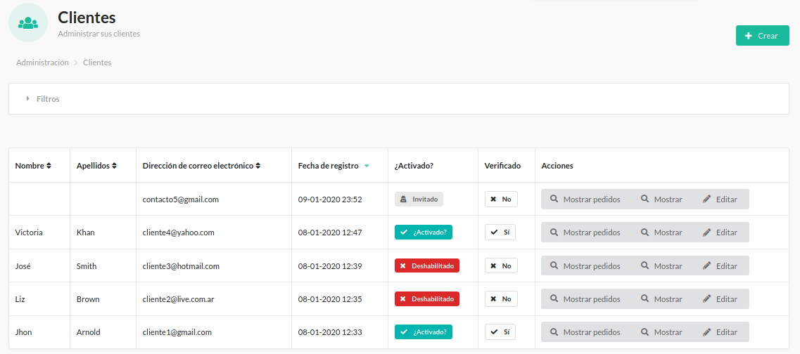
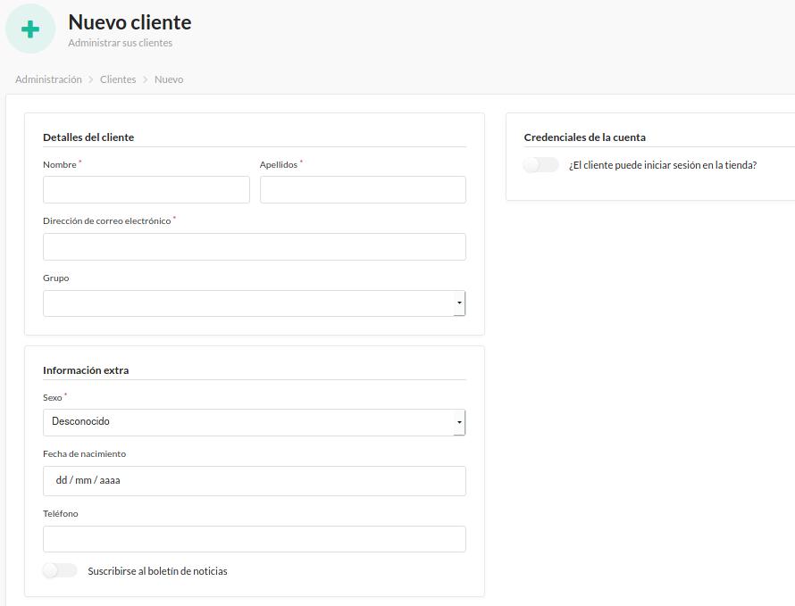
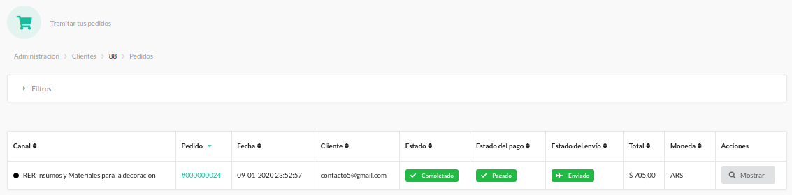
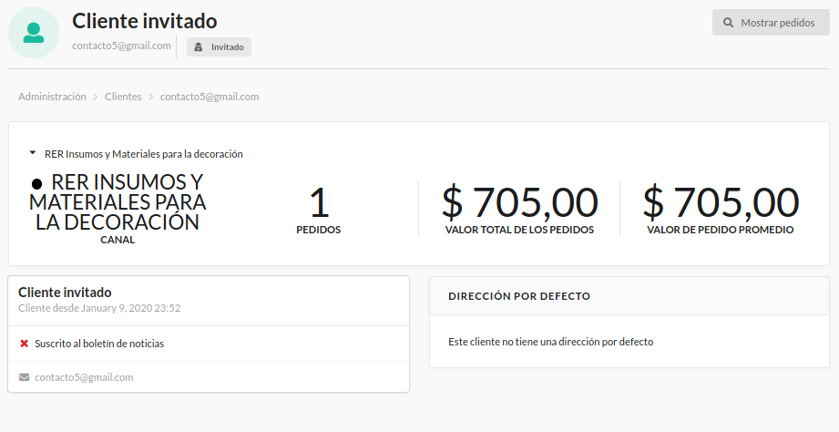
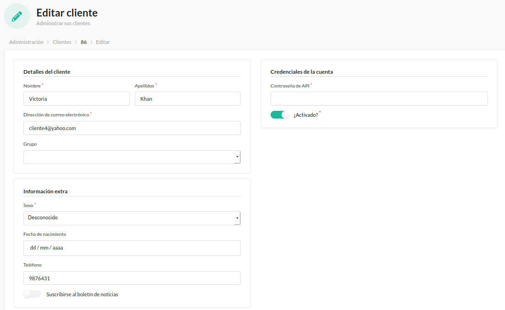
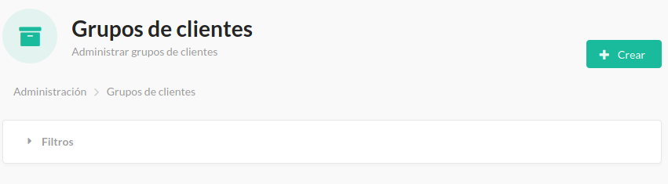
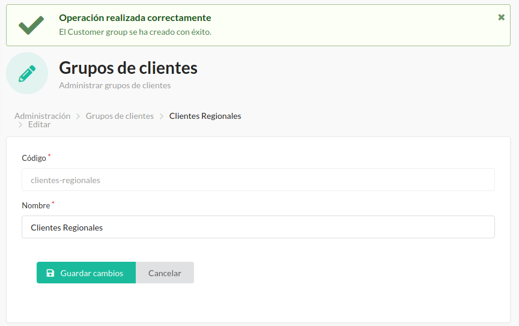
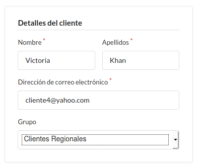

#######
Cliente
#######

   Menú de Clientes.

Esta sección es importante para gestionar los clientes y sus datos, así como seguir sus estadísticas.

El menú Clientes contiene los ítems:

* Clientes_
* Grupos_

-----------

.. _Clientes:

Clientes
********

Como primer lugar vemos la lista de clientes y datos generales sobre ellos. También podemos ver si está **Activados**, **Deshabilitados** o si no se han registrado y figuran como **Invitados**.

   Lista de Clientes.

.. note:: Al momento de registrarse como **Cliente**, el sistema envía un mail al mismo pidiendo que confirme su identidad y la validez del mail a través de un enlace de activación. Si hace click en el enlace se lo indica como **Verificado**.

.. warning:: Es importante que los clientes verifiquen su correo electrónico. Ya que si no lo hacen podría tratarse de un email falso o erroneo, el cual no permitirá contactarse con el cliente en los casos necesarios.

Contamos con la posibilidad de agregar **Nuevo cliente** sin necesidad que el mismo se registre.

   Nuevo cliente.

También podemos **Mostrar pedidos** del cliente que elijamos.

   Mostrar pedidos.

Dentro de esta página contamos con el botón **Mostrar** que nos llevará a una página con la estadística del cliente y sus pedidos.

   Estadísticas del Cliente.

Desde la lista de clientes podremos **Editar un cliente**. Aquí podremos **Deshabilitar** o **Activar** a un cliente.

   Editar Cliente.

.. _Grupos:

Grupos
******

Podremos crear grupos de clientes en esta sección.

   Grupo de Clientes.

Debemos completar los datos y hacer click en **Crear**. De esta forma se creará el nuevo grupo de clientes y nos confirmará con un cartel la acción positiva.

   Grupo de Clientes creado.

Finalmente se agregan los clientes al grupo desde la configuración del cliente en el área **Detalles del Cliente**, en el desplegable **Grupo**.

   Detalles del Cliente.

