#########
Marketing
#########

.. figure:: images/117-marketing.png
   :align: right

   Menú de Marketing.

Unas de las principales vías de difusión de estos días son las promociones y los cupones.

Esta sección permite gestionar diversos tipos de promociones y descuentos. 

El menú Marketing cuenta con estas opciones:

* Promociones_
* `Reseñas de producto`_

-----------

.. _Promociones:

Promociones
***********

Ingresamos a **Promociones** y hacemos click en **Crear**.

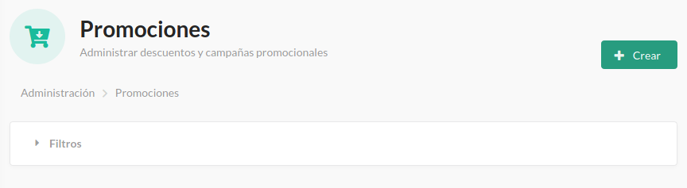

   Crear Promociones.

Luego completamos las condiciones de la **Nueva Promoción**.

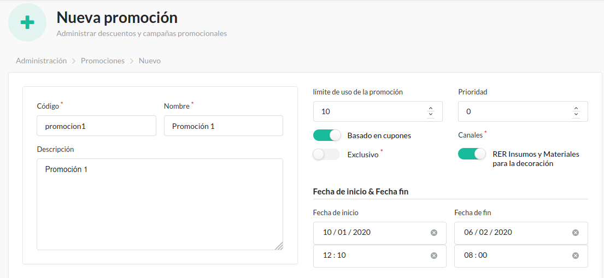

   Nueva promoción.

En las **Reglas** establecemos a *quiénes* irá dirigida la promoción. Y en **Acciones** determinamos el *beneficio* que brindará. Finalmente le damos al botón **Crear**.

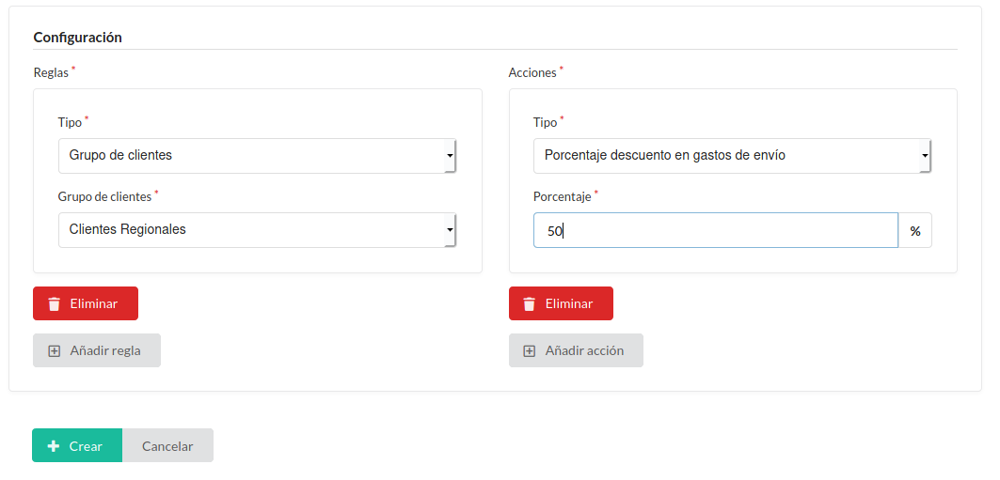

   Crear Promociones.

Aquí nos confirmará el éxito en la acción y nos permitirá **Administrar los cupones**.

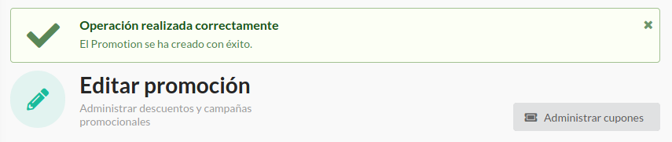

   Confirmación de operación exitosa.

Una vez dentro de los cupones para la **Promoción 1** ingresamos a **Generar**.

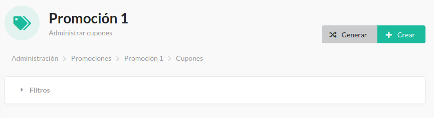

   Promoción 1.

Aquí podemos elegir el principio, final y la longitud intermedia del código para obtener el beneficio. La cantidad de cupones a generar, el vencimiento de los mismos y su límite de uso.

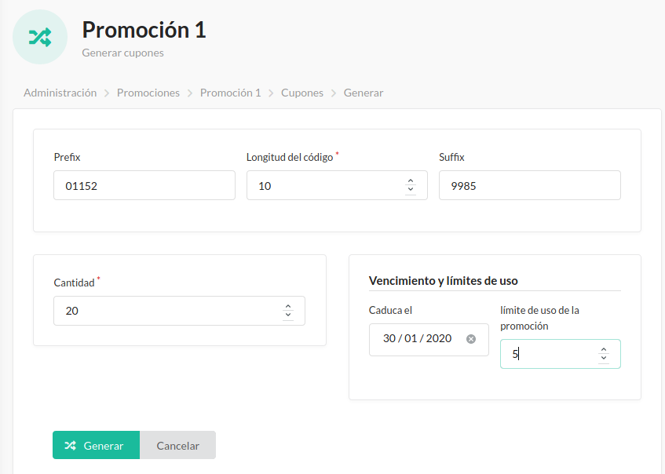

   Generar cupones.

De esta manera obtenemos la lista de los cupones que hemos generado.

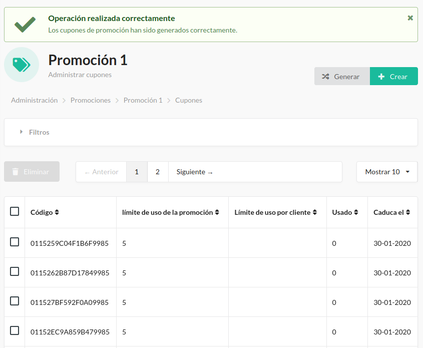

   Lista de cupones.

Volviendo a la sección **Promociones** podemos configurar la promoción recientemente agregada.

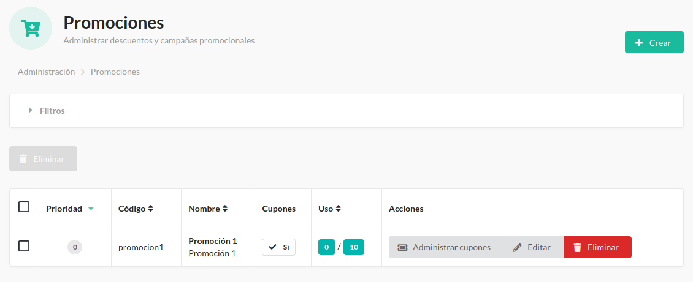

   Lista de Promociones.

.. _Reseñas de producto:

Reseñas de producto
*******************

El sistema cuenta con la posibilidad de que los clientes agreguen reseñas de nuestros productos.

Esto nos permite, no sólo reafirmar las ventajas de los mismos frente a otros, sino también conocer los defectos y tomar medidas al respecto.

Ingresando a esta sección podremos ver y controlar los comentarios acerca de nuestros productos realizados por los clientes

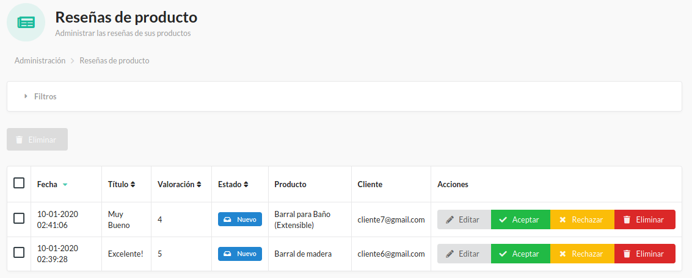

   Reseñas de productos.

.. hint:: Sea respetuoso de las opiniones de sus clientes evitando modificar las mismas o sus puntajes. Ante la necesidad es preferible que rechace la reseña a que altere el contenido.

Para modificar una reseña basta con ingresar a **Editar**.

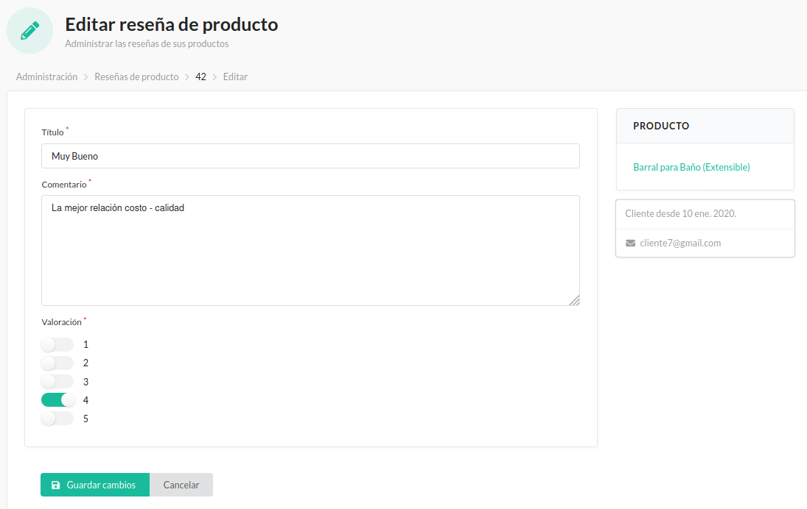

   Editar reseña.

También se pueden **Aceptar** o **Rechazar** a modo de *moderación del contenido*.

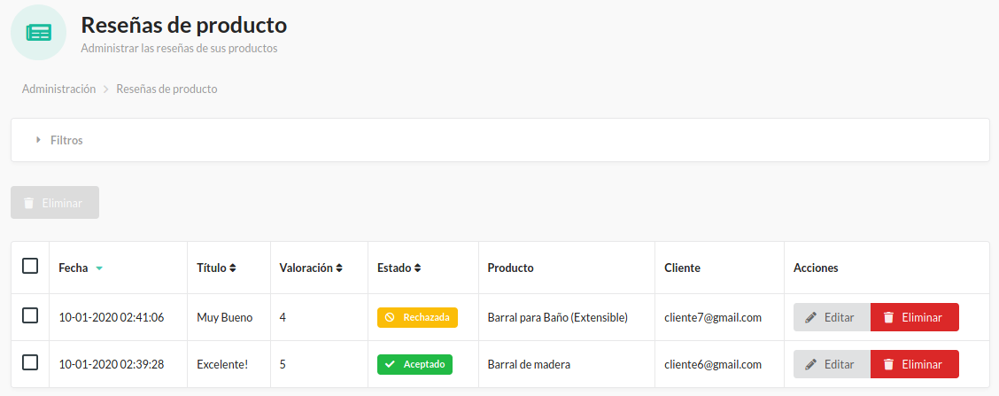

   Confirmación de operación exitosa.

