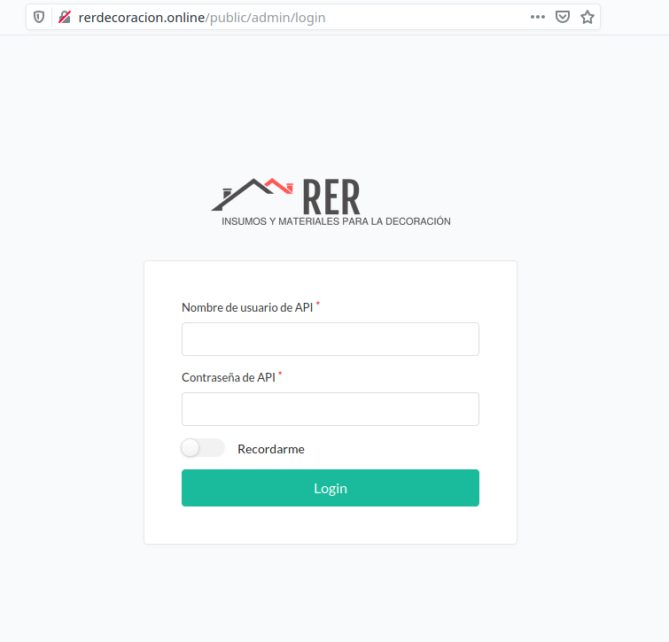

Inicio de sesión
================

El ingreso al sistema se realiza mediante el navegador web de manera diferente al inicio de sesión del cliente.

.. sidebar:: *Recuerde*
      
      Debe solicitar el **nombre de usuario** y **contraseña** a su proveedor para acceder al panel de configuración.

Para iniciar la sesión, usted debe ingresar en su navegador favorito (firefox, chrome, etc.).

A continuación debe ingresar en la barra de direcciones el **dominio de su sitio web** añadiendo al final del mismo **/public/admin** , para poder visualizar el acceso al sistema.

Por ejemplo: ::

    http://su_dominio/public/admin

Luego introducir su **usuario** y **contraseña**.

Por último haga click en *Login* para ingresar.

.. warning:: No divulgue los datos de la cuenta. El acceso a la información sensible queda bajo su exclusiva responsabilidad.
         

  Acceso de usuario.

  
.. note:: En este manual utilizaremos de ejemplo una empresa virtual llamada "RER decoración". Por lo tanto el dominio, datos e imágenes corresponderán a dicha empresa.

