######
Ventas
######

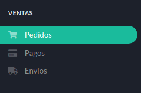

   Menú ventas.

La sección **Ventas** es una de las más dinámicas y donde pasaremos más tiempo. En ella vamos a *recibir los pedidos*, *controlar los pagos* y *gestionarlos envíos*.

El menú **Ventas** cuenta con los siguientes ítems:

* Pedidos_
* Pagos_
* Envíos_

.. _Pedidos:

Pedidos
*******

En esta sección encontraremos una lista con todos los pedidos realizados tanto por clientes con cuenta, como por los que no se hayan registrado.

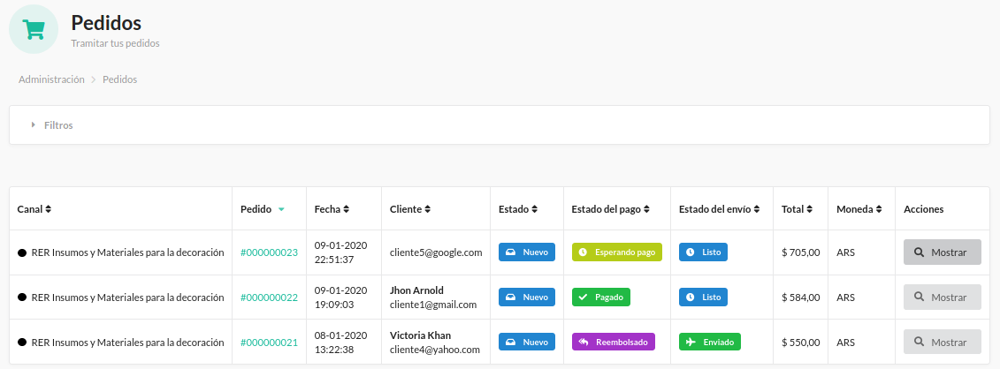

   Pedidos.

En ella podemos observar los pedidos y su estado, el del pago y el del envío. También podremos seleccionar cada uno para tener más detalles.

En el detalle también podremos ver los datos del comprador y los necesarios para realizar la facturación mediante la vía que disponga el ente tributario.

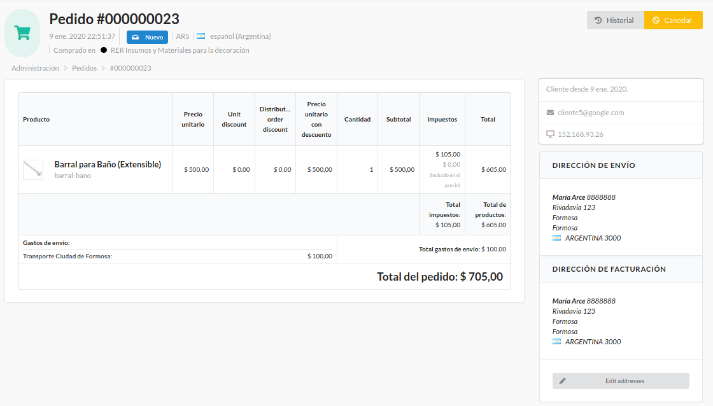

   Detalles del Pedido.

Además de lo indicado anteriormente, se dispone del cuadro de **Pago** y del cuadro de **Envío**.

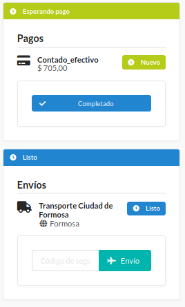

   Cuadros de Pago y Envío.

En el de **Pago** podrémos indicar *cuando haya sido efectuado* presionando el botón **Completado**

Al de **Envío** le podremos asignar un *código de seguimiento* e indicar cuando haya sido enviado.

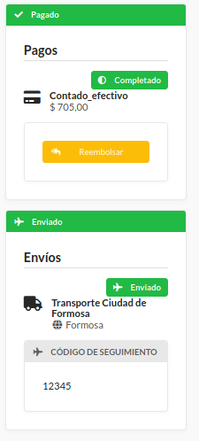

   Cuadros de Pago y Envío en estados *completados*.

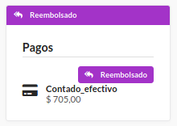

   Cuadros de Pago con *reembolso realizado*.

También podremos ver el historial del pedido.

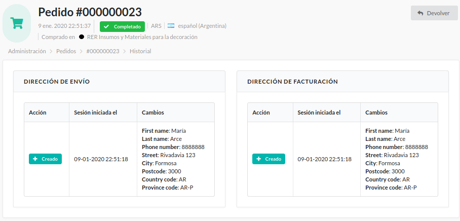

   Historial del pedido.

.. _Pagos:

Pagos
*****

Podremos ver los pagos listados en su sección. Lo más destacable aquí es el estado del pago y la posibilidad de indicar su realización *presionando* el botón **Completado**.

A su vez podremos ingresar al detalle de la compra.

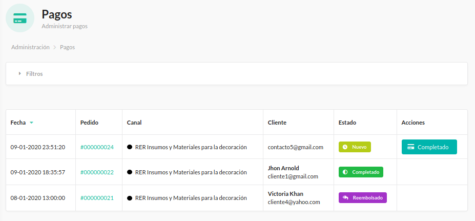

   Pagos.

Aquí activamos el botón **Completado** y vemos como cambia el estado del producto y aparece un cartel de *operación correcta* indicando que el pago ha sido realizado.

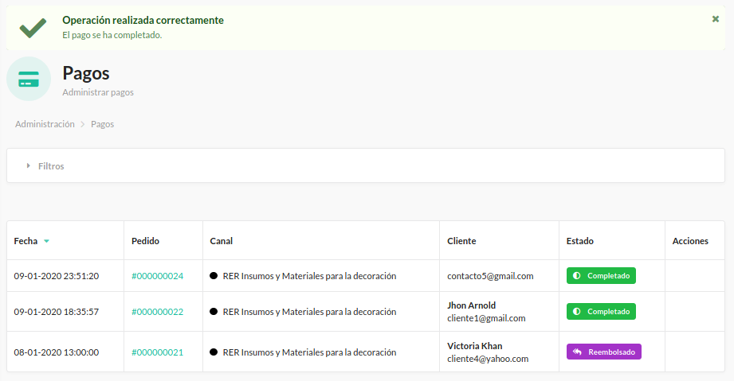

   Pago completado.

.. _Envíos:

Envíos
******

Aquí indicaremos los envíos que hayan sido realizados. Para esto contamos con el botón **Envío**.

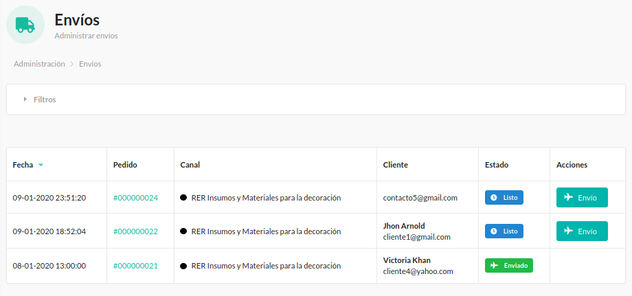

   Envío.

Si hacemos click en **Envío** vemos como se modifica el estado a **Enviado** y nos confirma el éxito de la acción con un cartel.

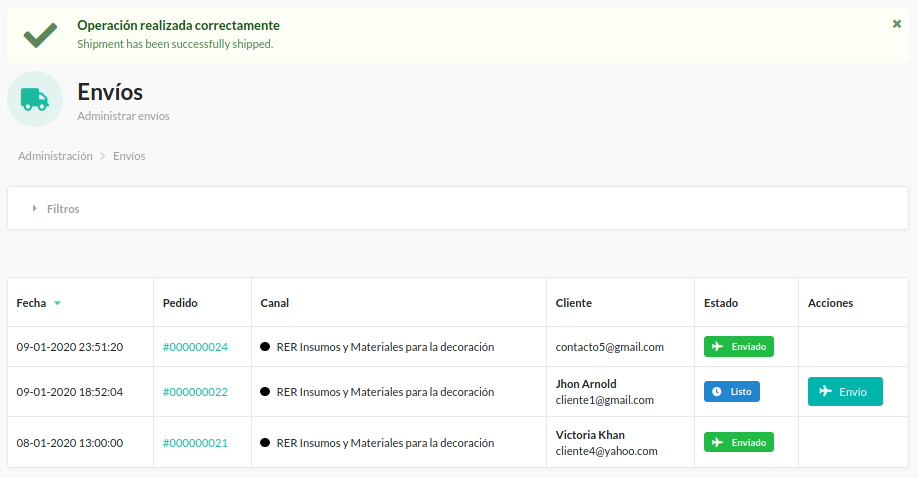

   Envío realizado.

